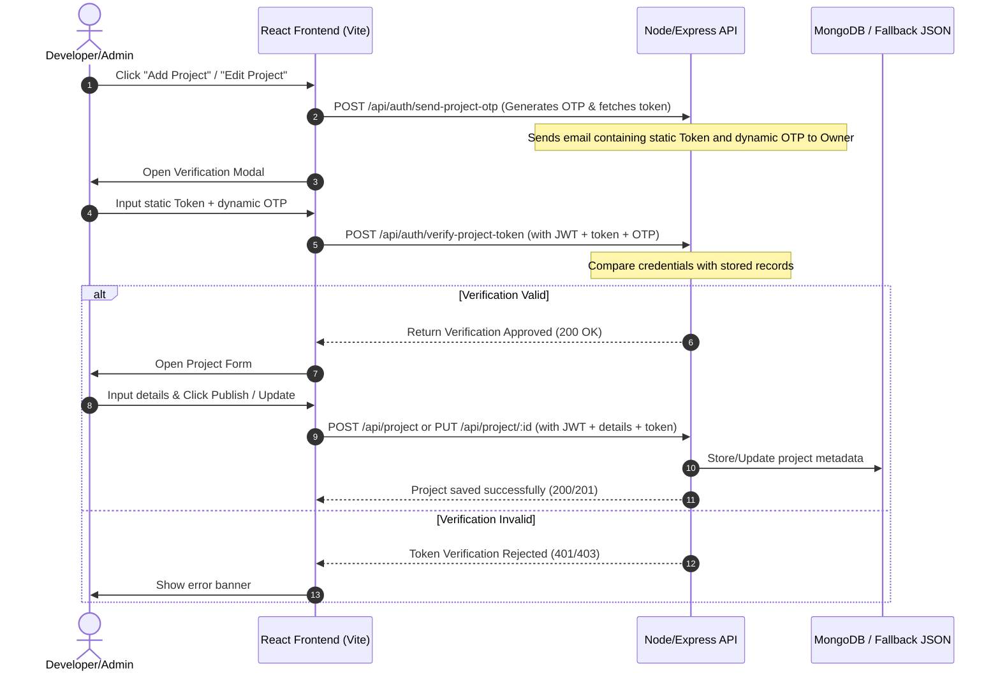

# 🛡️ PortfolioX — Secure Portfolio Platform (MERN Stack)

[](https://nodejs.org/)
[](https://react.dev/)
[](https://tailwindcss.com/)
[](https://opensource.org/licenses/MIT)

A production-ready, highly secure personal portfolio platform built with the **MERN (MongoDB, Express, React, Node.js) Stack**, powered by **Tailwind CSS v4** and **Vite**. It features robust credential verification protocols, dual-key protection, local file uploads, and full CRUD dashboards for resume documents, certifications, technical skills, experiences, and gallery events.

---

## 🎨 Key Features & Layouts

### 1. 🏠 Responsive Visitor Interface
* **Home Profile**: Displays dynamic typing animations, professional statistics (Years of Experience, Projects, Awards), location, and biography sections.
* **Resume / CV Integration**: Admin can upload their Resume/CV directly from the dashboard. Visitors can click **Explore Resume CV** to dynamically view or download the uploaded document.
* **Featured Projects Grid**: Shows all projects with search filtering and difficulty sorting. Visitors can bookmark projects in local storage, view play store/app store links, share projects via a custom social media modal (supporting WhatsApp, Telegram, LinkedIn, Naukri.com, X, and direct copy-link), and toggle likes.
* **Licenses & Certifications**: Dedicated certifications layout displaying credential titles, issuing organizations, and dates. Clicking any certificate opens a dedicated details viewer showing the full details alongside an embedded native image or PDF preview.
* **Event Gallery**: Grid layouts showing achievements, events, and setup screenshots.
* **Interactive Contact Form**: A contact panel containing fields for **Name**, **Email**, **Mobile Number**, **Subject**, and **Message**. Submitting the form saves the message to the DB, alerts you in the admin notifications panel, and dispatches a live SMTP email notification.
* **Appearance Synchronizer**: Supports dynamic theme toggling (Dark, Light, Glassmorphism) with synced configurations saved directly to the backend profile.

### 2. 🔐 Security & Anti-Spam Measures
* **No Public Signups**: The registration gate is completely disabled (`/register` unrouted). Only the predefined, verified admin owner can sign in.
* **Dual-Key Project Verification**: To add or edit projects, the owner must enter their static **Portfolio Verification Token** alongside a dynamic **6-digit Verification Code (OTP)** automatically sent to the owner's registered email address upon authorization. Both keys are validated on the Express backend before unlocking project writes (`POST` and `PUT` routes).
* **Token Regeneration Security**: The owner can regenerate their token from the dashboard only by providing their account password.
* **Visitor vs Owner Role Authorization**: Only Owner accounts can publish projects, update details, edit timelines, view message logs, or access dashboard panels.

### 3. 🎛️ Content Manager (Dashboard Panel)
* **Projects Editor**: Full CRUD interface to publish new projects or edit existing ones. Allows uploading local screenshot files (`png, jpg, jpeg, gif, webp`) directly from your machine.
* **Biography Details**: Modify name, profile avatar (with local upload support), headline, location, and social links.
* **Certifications CRUD**: Add/edit/delete certifications. Upload certification files (images, SVGs, or PDFs) directly to render them inline on the detail viewer.
* **Skills & Proficiency**: CRUD editor to add/edit/delete skills and categorize them (Frontend, Backend, DevOps, Database, Tools, Languages, Core) with a proficiency slider (1%-100%).
* **Milestones (Experience)**: CRUD editor for career timeline entries (Company, Position, Location, Joining/Leaving Dates, Responsibilities, Achievements).
* **Milestones (Education)**: CRUD editor for educational history (Degree, College, University, Percentage, CGPA, Years) with a local certificate uploader.
* **Gallery & Events**: CRUD editor for media assets (Title, Type, Category, Description) with a local uploader.

### 4. ⚡ Developer & Recruiter Conveniences
* **Analytical Recruiter Trackers**: Dashboard panels grouping visitors' device types, browser form factors, operating systems, profile views, and resume download event counters.
* **ATS-Optimized Resume Link**: Directly links to `/print-cv` route for recruiters to view, print, or save an ATS-friendly resume layout as PDF.

---

## 🏗️ System Architecture & Workflow

### 📋 Token Verification Workflow


### 💾 Dual-Resiliency Architecture
The application features a double-resilience mechanism protecting both database connectivity and server API availability:

1. **Database Failover (Server-Side)**: When the Node server starts, it checks connectivity to MongoDB. If MongoDB is offline, it automatically switches to a local file-based database fallback (`server/data/db_fallback.json`) and seeds it with default data. This allows the project to run 100% out of the box with zero external database dependencies!
2. **Client static fallback (Client-Side)**: If the backend connection fails entirely, the frontend React app logs a warning and automatically serves hardcoded client-side mockup data to visitors, keeping the UI intact and readable.

---

## 📁 Project Directory Structure

```bash
Portfolio/
├── server/                  # Node.js + Express API
│   ├── config/
│   │   ├── mailer.js         # Nodemailer setup, fallback logger, and email dispatcher
│   │   ├── mockDb.js         # Seeding logic & JSON fallback DB router helper
│   │   └── dbSeeder.js       # Seeding default collections in MongoDB Atlas/Local
│   ├── data/
│   │   └── db_fallback.json  # Fallback JSON database file (automatic failover)
│   ├── middlewares/
│   │   └── authMiddleware.js # JWT validation & Owner role check filters
│   ├── models/
│   │   ├── User.js           # User schema (theme settings, timelines, contact handles)
│   │   ├── Project.js        # Project schema (difficulty, views, likes, downloads)
│   │   ├── Skill.js          # Skills classification schema
│   │   ├── Experience.js     # Experience timeline schema
│   │   ├── Education.js      # Education records schema
│   │   ├── Certificate.js    # Certifications schema
│   │   ├── Testimonial.js    # Testimonial reviews schema
│   │   ├── Blog.js           # Markdown blog posts schema (with comments)
│   │   ├── Gallery.js        # Event gallery media metadata schema
│   │   ├── Message.js        # Contact inbox messages schema (with email & phone)
│   │   ├── Analytics.js      # Recruiter activity logs schema (OS, browser, device)
│   │   └── Notification.js   # Admin dashboard notification schema
│   ├── routes/
│   │   ├── auth.js           # Login, OTP verification, token verify/regen routes
│   │   ├── project.js        # Secure project CRUD routes (POST, PUT, DELETE) guarded by token
│   │   ├── portfolio.js      # Public portfolio details, local uploads, and appearance routes
│   │   ├── collections.js    # Timelines/skills/gallery/testimonials CRUD endpoints (POST, PUT, DELETE)
│   │   ├── messages.js       # Contact form submissions & email dispatch notifications
│   │   └── dashboard.js      # Recruiter analytics aggregates & notifications clear
│   ├── uploads/              # Local folder storing uploaded screenshots/avatars
│   ├── .env                  # Port, JWT secret, SMTP credentials, and variables
│   ├── nodemon.json          # nodemon config ignoring changes to dynamic uploads/data
│   └── server.js             # Main backend server bootstrap
│
│── client/                   # React Single Page App (Vite + JavaScript)
│   ├── dist/                 # Production compiled client output
│   ├── public/               # Public assets folder (e.g. logo.png, AR.jpg, Updated_Resume.pdf)
│   ├── src/
│   │   ├── context/
│   │   │   └── AuthContext.jsx# Authentication session & theme synchronizer
│   │   ├── components/
│   │   │   └── Navbar.jsx     # Sticky header navigation (hidden on print)
│   │   ├── pages/
│   │   │   ├── PublicPortfolioPage.jsx # Visitor-facing landing profile with filters
│   │   │   ├── ProjectDetailsPage.jsx  # Dynamic project details and terminal showcase
│   │   │   ├── CertificateDetailsPage.jsx # Dedicated certification viewer (supports PDFs/images)
│   │   │   ├── LoginPage.jsx  # Sign-in & forgot-password verification
│   │   │   ├── DashboardPage.jsx# Interactive admin panel (Metrics, CRUD tables, Security token)
│   │   │   ├── BlogsListPage.jsx# Searchable articles list
│   │   │   ├── BlogDetailsPage.jsx# Read articles & submit comments
│   │   │   └── ResumePrintPage.jsx # Printable ATS-optimized CV layout
│   │   ├── utils/
│   │   │   └── api.js         # Axios API interceptors and helper routes
│   │   ├── App.jsx            # Router paths
│   │   ├── main.jsx           # React app mount bootstrap
│   │   └── index.css          # Design system variables, glassmorphism CSS
│   └── vite.config.js        # Dev proxy configurations pointing to port 5000 (API & uploads)
```

---

## 🚀 Setting Up & Running Locally

### 1. Configure Environment Variables
Create a **`.env`** file inside your **`server/`** folder:
```env
PORT=5000
MONGO_URI=mongodb://127.0.0.1:27017/portfolio
JWT_SECRET=supersecretjwtkey_portfolio_2026
OTP_SECRET=otp_jwt_secret_key_12345
CLOUDINARY_CLOUD_NAME=mock
CLOUDINARY_API_KEY=mock
CLOUDINARY_API_SECRET=mock

# Live SMTP Notification Setup (Optional - Simulator triggers if empty)
SMTP_SERVICE=gmail
SMTP_HOST=smtp.gmail.com
SMTP_PORT=587
SMTP_SECURE=false
SMTP_USER=your-email@gmail.com
SMTP_PASS=your-google-app-password
```

### 2. Install All Dependencies (Root, Server, and Client)
From the project root directory, run:
```bash
npm run install:all
```

### 3. Run Frontend & Backend Concurrently
To start both the Express API and the React Vite client parallelly in development mode with a single command:
```bash
npm run dev
```
Open **[http://localhost:3000](http://localhost:3000)** in your browser.

---

## 🔌 API Reference

### 🔐 Authentication (`/api/auth`)
| Method | Endpoint | Description | Auth Requirement |
| :--- | :--- | :--- | :--- |
| `POST` | `/signup` | Register a new user account. | None |
| `POST` | `/login` | Authenticate credentials and return JWT. | None |
| `POST` | `/send-project-otp` | Generate and dispatch project token & OTP email. | JWT (Owner Only) |
| `POST` | `/verify-email` | Verify email address using a 6-digit OTP. | JWT Bearer |
| `POST` | `/verify-project-token` | Validates static token + dynamic OTP. | JWT (Owner Only) |
| `POST` | `/regenerate-token` | Regenerate security token (requires password). | JWT (Owner Only) |
| `POST` | `/forgot-password` | Request password reset OTP. | None |
| `POST` | `/reset-password` | Reset password using verified OTP. | None |

### 📁 Projects (`/api/project`)
| Method | Endpoint | Description | Auth Requirement |
| :--- | :--- | :--- | :--- |
| `GET` | `/` | Fetch all public/published projects. | None |
| `GET` | `/:id` | Fetch project details and increment views. | None |
| `POST` | `/` | Publish a new project. | JWT + `portfolioToken` in body |
| `PUT` | `/:id` | Edit project details. | JWT + `portfolioToken` in body |
| `DELETE`| `/:id` | Remove a project. | JWT (Owner Only) |
| `POST` | `/:id/like` | Toggle project like counter. | JWT Bearer |

### 🛠️ Portfolio (`/api/portfolio`)
| Method | Endpoint | Description | Auth Requirement |
| :--- | :--- | :--- | :--- |
| `GET` | `/owner` | Fetch public owner profile, skills, projects, and testimonials. | None |
| `PUT` | `/profile` | Update profile biography, CV resume, and contact details. | JWT (Owner Only) |
| `PUT` | `/appearance` | Update accent color schemes and UI layouts. | JWT (Owner Only) |
| `POST` | `/upload` | Upload local media (images, PDFs, documents) to static directory. | JWT (Owner Only) |
| `POST` | `/track-download` | Log a resume download analytic. | None |

---

## 🧪 Credentials Walkthrough

### 1. Login Details (Owner Dashboard)
* **Access URL**: [http://localhost:3000/login](http://localhost:3000/login)
* **Email**: `owner@portfolio.com` (or your configured email once registered/seeded)
* **Password**: `password123`

### 2. Verify Security Upload Gate
1. Log in with the owner credentials above.
2. Navigate to the sidebar and click **Projects Management**.
3. Clicking **Add Project** triggers the security dispatch. Both your **static portfolio token** and a **dynamic 6-digit email OTP** are sent to your registered SMTP email address (or logged to the console).
4. Input both verified credentials into the modal.
5. Click **Verify Token**. Write controls will unlock, enabling full CRUD publishing capabilities!
