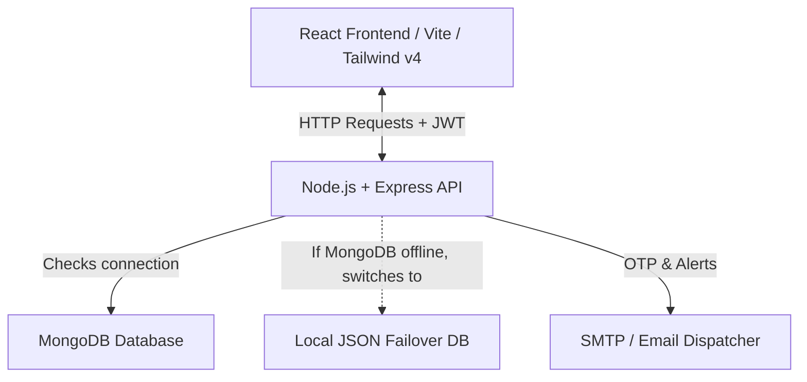
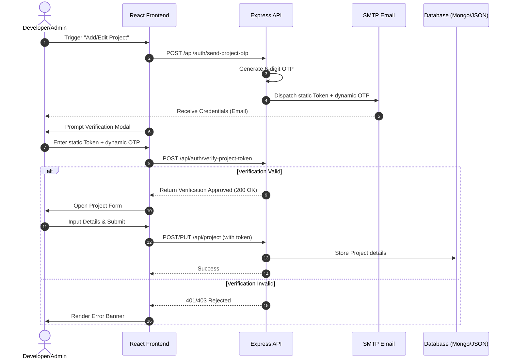

# 🛡️ PortfolioX — Secure Portfolio Platform (MERN Stack)

[](https://nodejs.org/)
[](https://react.dev/)
[](https://tailwindcss.com/)
[](https://opensource.org/licenses/MIT)

PortfolioX is a production-ready, highly secure personal portfolio platform built with the **MERN (MongoDB, Express, React, Node.js) Stack**, styled with **Tailwind CSS v4** and bundled with **Vite**. 

It features dual-key verification gates, automatic database failover protection, built-in recruiter analytics trackers, dynamic theme controls (Dark, Light, Glassmorphism), and comprehensive CRUD dashboards for administrative management.

---

## 🏗️ System Architecture & Workflow

PortfolioX is designed with a decoupled **Client-Server Architecture** optimized for high security and database resilience:



### 1. Dual-Resiliency Database Architecture
To guarantee 100% uptime and an "out-of-the-box" runnable state, PortfolioX implements a double-resilience pattern:
* **Server-Side Failover**: Upon bootstrap, the Node/Express server attempts a connection to MongoDB. If the connection fails (e.g., offline or network error), the server automatically switches to a local file-based database (`server/data/db_fallback.json`) powered by synchronous read/write helper utilities in [mockDb.js](file:///D:/Code/Portfolio2/server/config/mockDb.js).
* **Client-Side Fallback**: If the Express backend server goes completely offline, the React client logs a warning and automatically renders pre-configured client-side mock data so visitors always see a functional portfolio layout.

### 2. Dual-Key Upload Gate Verification
Administrative operations (such as publishing or updating projects) are guarded by a two-factor verification pipeline:
* **Static Token**: A secure token stored in the owner's database document.
* **Dynamic OTP**: A 6-digit one-time passcode generated dynamically and sent to the owner's email address.



---

## 🎨 Key Features

### 🏠 Responsive Visitor Interface
* **Dynamic Profile Hub**: Displays structured bios, skills, location, typing animations, and professional statistics.
* **Featured Projects Grid**: Supports real-time text searching, difficulty filtering, dynamic likes, bookmarks (local storage), and sharing via custom social portals.
* **Licenses & Certifications**: Grid layouts linking credentials to dedicated inline modal viewers (supporting SVGs, images, and native PDF documents).
* **Career & Education Timelines**: Clean, chronological roadmaps detailing responsibilities and achievements.
* **Interactive Contact Panel**: Visitors can submit inquiries which write to the database, trigger platform dashboard notifications, and dispatch email alerts to the owner.
* **Appearance Synchronizer**: Instant light/dark/glassmorphism toggling synced to the owner's database preference.
* **ATS Resume Generator**: A dedicated printable route (`/print-cv`) utilizing CSS print queries to generate clean, paper-optimized, PDF-exportable resumes.

### 🔄 Automated Integrations
* **Education-to-Certificate Auto-Sync**: When an administrator adds or updates an educational record and includes a certificate link, the server automatically generates a corresponding Certificate entry. It copies the title, organization, date, and link into the Licenses & Certifications grid automatically.

### 📊 Real Analytics & Interactions
* **Visitor Clicks & Clicks Tracker**: Records profile views, project detail clicks (`project_click` events), and resume downloads.
* **Real Likes System**: Guests and registered users can toggle project likes directly from the home page cards or showcase details. Likes are tracked uniquely in the database based on JWT token or visitor IP address (`x-forwarded-for` / `remoteAddress`) to prevent duplicate voting.
* **Analytical Recruiter Trackers**: Aggregates visitor metrics, counting profile views, resume downloads, device form factors (mobile/desktop), operating systems, and browsers.
* **Admin Dashboard Hub**: Comprehensive dashboard to perform complete CRUD operations on projects, career milestones, educational items, certificates, and gallery events.
* **Anti-Spam Controls**: Throttling via API rate limiters, strict JWT verification, and email spoofing protection.

---

## 📁 Directory Structure

```bash
Portfolio/
├── server/                     # Node.js + Express REST API
│   ├── config/
│   │   ├── mailer.js           # Nodemailer transport & fallback email configuration
│   │   ├── mockDb.js           # Read/write utilities for JSON database fallback
│   │   └── dbSeeder.js         # Seeds database collections in MongoDB/JSON
│   ├── data/
│   │   └── db_fallback.json    # Local JSON database fallback
│   ├── middlewares/
│   │   └── authMiddleware.js   # JWT validation & Owner authorization
│   ├── models/                 # Mongoose schema models
│   ├── routes/                 # REST routing handlers (auth, project, messages, dashboard, portfolio)
│   ├── uploads/                # Directory for local media and avatar uploads
│   └── server.js               # Express application entry point
│
└── client/                     # React Single Page App (Vite + JS)
    ├── src/
    │   ├── context/
    │   │   └── AuthContext.jsx # Authentication session & theme synchronizer
    │   ├── components/
    │   │   └── Navbar.jsx      # Navigation header (responsive & printable)
    │   ├── pages/              # Core pages (Portfolio, Dashboard, Login, Resume)
    │   ├── utils/
    │   │   └── api.js          # API helper wrappers
    │   ├── App.jsx             # React routing configurations
    │   ├── main.jsx            # Mounting node bootstrap
    │   └── index.css           # Tailwind CSS imports & theme utilities
    └── vite.config.js          # Vite server and proxy configuration
```

---

## 🚀 Setting Up & Running Locally

### 1. Configure Environment Variables
Create a **`.env`** file inside your **`server/`** folder and configure your variables:

```env
PORT=5000
MONGO_URI=your_mongodb_uri_here
JWT_SECRET=your_jwt_secret_key_here
OTP_SECRET=your_otp_secret_key_here
CLOUDINARY_CLOUD_NAME=mock
CLOUDINARY_API_KEY=mock
CLOUDINARY_API_SECRET=mock

# Live SMTP Configuration (Optional)
SMTP_SERVICE=gmail
SMTP_HOST=smtp.gmail.com
SMTP_PORT=587
SMTP_SECURE=false
SMTP_USER=your_email_address_here
SMTP_PASS=your_email_app_password_here
SMTP_FROM_NAME="PortfolioX Alerts"
```

### 2. Install Dependencies
Install all package dependencies for the root workspace, client, and server from the root directory:
```bash
npm run install:all
```

### 3. Run the Development Server
Launch both the Express API and Vite React client concurrently:
```bash
npm run dev
```
Once started:
* Client runs on: **[http://localhost:3000](http://localhost:3000)** (or http://localhost:3001 if port 3000 is occupied)
* API runs on: **[http://localhost:5000/api](http://localhost:5000/api)**

---

## 🔌 Core API Endpoints

### 🔑 Authentication (`/api/auth`)
* `POST /login`: Authenticates credentials and returns a JWT.
* `POST /send-project-otp`: Dispatches authorization codes for project modifications.
* `POST /verify-project-token`: Validates token and OTP codes.
* `POST /regenerate-token`: Re-generates security upload gate tokens.

### 📁 Projects & Content (`/api/project`)
* `GET /`: Retrieves public projects (supports queries: `?search=`, `?difficulty=`, `?sort=`).
* `GET /:id`: Retrieves a single project details and increments page views.
* `POST /` / `PUT /:id`: Guards publication and modification of project items.
* `DELETE /:id`: Deletes projects from database (JWT protected).
* `POST /:id/like`: Toggles visitor likes (supports both guests via IP and logged-in owners).

### 📊 Dashboard & Portfolio (`/api/dashboard`)
* `GET /analytics`: Retrieves metrics and visitor device characteristics.
* `GET /notifications`: Fetches dashboard alert notifications.
* `PUT /notifications/read`: Marks notifications as read.

---

## 🌐 Production Deployment & Render Configuration

PortfolioX is configured to compile into a single-port production build served by the Express server, making it extremely easy to host on platforms like **Render**, **Heroku**, or **AWS**.

### 1. Build and Start Scripts (Root package.json)
The root [package.json](file:///D:/Code/Portfolio2/package.json) contains pre-configured scripts for single-command production builds:
* **Build Command (Render)**: `npm run build` installs all workspace packages and compiles the React frontend bundle into `client/dist`.
- **Start Command (Render)**: `npm start` boots the Node/Express server in production, serving the static client from the compiled `client/dist` directory.

### 2. Persistent Storage on Render (Crucial for Local Uploads)
Because Render container file systems are ephemeral, files uploaded directly to `server/uploads/` will be **deleted** whenever the container restarts, sleeps, or redeploys. To prevent this and persist your certificate PDFs, project screenshots, and profile images:
1. In your Render Dashboard, select your service, go to **Disks**, and click **Add Disk**.
2. Mount the disk at: `/opt/render/project/src/server/uploads` (or your absolute project uploads directory path).
3. Alternatively, upload certificates to persistent cloud hosts (like Google Drive, S3, or Imgur) and paste the URL directly into the **Image URL** dashboard input.

### 3. Helmet & PDF Previews
To allow PDF certificate previews to render within same-origin `<iframe>` wrappers on the website, Helmet's default Content Security Policy (CSP) is configured to disable script/iframe blocking (`contentSecurityPolicy: false` and `crossOriginEmbedderPolicy: false`). This maintains general security headers (XSS, Clickjacking, MIME-sniffing protection) while keeping built-in browser PDF engines functional.

### 4. Trust Proxy & Rate Limiting
Because PortfolioX is hosted behind reverse proxies (like Render's routing layer), Express must be configured to trust the proxy headers. The server entry point [server.js](file:///D:/Code/Portfolio2/server/server.js) calls `app.set('trust proxy', 1);`. This enables `express-rate-limit` to accurately identify client IPs and prevents `ERR_ERL_UNEXPECTED_X_FORWARDED_FOR` validation crashes on proxy environments.
